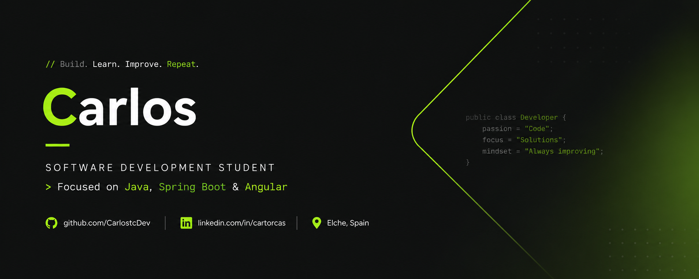

  

---

## 👤 About Me

I am an IT technician from Elche, Spain, passionate about understanding and mastering technology. I enjoy analyzing complex problems and designing scalable and efficient solutions through a structured and innovative approach. 

I am organized, detail-oriented, and have a strong ability to learn quickly and adapt to new challenges. I always look for improvements and propose solutions from different perspectives to contribute positively to the environment around me. 

My goal is to continue growing professionally, expanding my knowledge, and contributing to the success of the team and the company. I am a native Spanish speaker, with an intermediate level of English, allowing me to work with technical documentation and communicate effectively in professional environments.

--- 

### 💻 Academic Background
<table>
<tr>
<td width="70%" valign="top">

**Higher Technician in Multiplatform Application Development (DAM)**  
📍 IES Severo Ochoa · Alicante, Spain  
🗓️ 2025 – Present

- Developed applications using Java, focusing on object-oriented programming, data structures and software design principles.
- Built graphical user interfaces with JavaFX and worked with application architecture and user interaction design.
- Developed web applications using HTML, CSS and JavaScript, including synchronous and asynchronous API requests.
- Worked with relational and non-relational databases, including MariaDB, PostgreSQL, MongoDB and Redis.
- Used Git for version control and collaborative development workflows.
- Designed software solutions using UML diagrams, including use case diagrams, class diagrams and other software modeling techniques.
- Applied clean code principles, documentation practices and structured development methodologies.

</td>
</tr>

<tr>
<td width="70%" valign="top">

**Technician in Microcomputer Systems and Networks**  
📍 IES Severo Ochoa · Alicante, Spain  
🗓️ 2023 – 2025

- Configured and administered Linux and Windows servers, working with services such as DHCP, DNS, HTTP and FTP.
- Designed and managed virtualized environments and network infrastructures using VirtualBox.
- Performed hardware diagnostics, stress testing and performance analysis using tools such as MemTest86, Cinebench and 3DMark.
- Monitored and analyzed network traffic with Wireshark and implemented cybersecurity measures using firewalls, antivirus solutions and vulnerability scanning tools like OpenVAS.
- Managed operating systems, server environments, development tools and office infrastructures.

</td>
</tr>
</table>

---

### 💼 Work Experience
<table>
<tr>
<td width="70%" valign="top">

 

**NTT DATA** · Software Developer Intern

📍 Alicante, Spain  
🗓️ April 2026 – June 2026

- Developed backend applications using Java 18 with Spring Boot, implementing REST APIs, Spring Security, unit testing with JUnit and Mockito.
- Built frontend applications using Angular with TypeScript, HTML and CSS, working with Node.js tooling and modern web development practices.
- Managed project dependencies and builds using Maven, following structured software development workflows.
- Worked with PostgreSQL databases, designing and managing data persistence layers.
- Used Git for version control and collaborative development in a professional environment.
- Integrated AI-powered tools and agents to improve development workflows and productivity.

</td>

</tr>
</table>

## 📊 GitHub Stats

  

---

## 📱 Technologies

### 💻 Languages

### 🗄️ Databases

### 🚀 Frameworks & Libraries

### ⌨️ IDEs

### 🛠️ Tools

### 💻 Operating Systems

---

## 🎓 Certifications & Learning

  
  
  

---

## 📫 Contact

  
  
  

